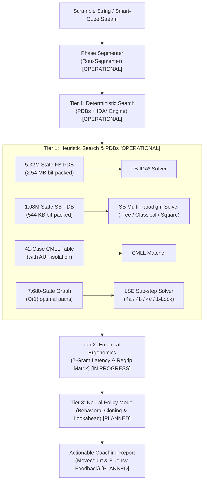

# Roux AI Speedcube Coach & Critique Engine (`roux-engine`)

[](https://www.python.org/downloads/)
[]()
[]()
[]()
[](LICENSE)

An automated speedcubing critique, diagnostics, and heuristic search engine tailored specifically to the **Roux method** of solving the Rubik's Cube. 

Engineered with **admissible $IDA^*$ search**, **sub-megabyte Pattern Databases (< 600 KB)**, **strict invariant verification**, and **empirical data analytics on human tournament solves**.

> [!NOTE]
> **New to the Rubik's Cube or Roux Method?** 
> You don't need any cubing experience to explore this project! See [The Roux Method Overview](#the-roux-method-overview) below for a step-by-step breakdown, or consult the [SpeedSolving Roux Method Wiki](https://www.speedsolving.com/wiki/index.php?title=Roux_method) for canonical speedcubing theory.

---

## Table of Contents
1. [Key Capabilities](#key-capabilities)
2. [The Roux Method Overview](#the-roux-method-overview)
3. [Architecture Overview](#architecture-overview)
4. [Project Status & Development Roadmap](#project-status--development-roadmap)
5. [30-Second Quickstart](#30-second-quickstart)
6. [CLI Reference & Capabilities](#cli-reference--capabilities)
7. [Empirical Human Benchmark](#empirical-human-benchmark)
8. [Getting Started & Development](#getting-started--development)
9. [Inspirations & Prior Art](#inspirations--prior-art)

---

## Key Capabilities

* **Admissible Heuristic Search ($IDA^*$):** Formulates Rubik's Cube phase completion as an exact graph search over combinatorial sub-spaces ($>4.3 \times 10^{19}$ total states), guaranteeing minimum-distance bounds $h(s) \le h^*(s)$.
* **Sub-Megabyte Pattern Databases (PDB):** Compresses a **5.32M state** First Block database into **2.54 MB** and a **1.08M state** Second Block database into **544 KB** using 4-bit packed nibbles with $O(1)$ bitwise lookup latency ($< 1\,\mu\text{s}$).
* **Multi-Paradigm Heuristic Solving:** Explores both unconstrained shortest paths (**Free Blockbuilding**, averaging **11.2 STM**) and human-mimetic cognitive stages (**Classical Standard**, observing DR-first and pair slotting constraints).
* **Automated Soundness & Invariant Proofs:** 450 automated tests verify First Block preservation, M-slice center alignment, and moveset generator compliance across all solutions.
* **Empirical Validation:** Benchmarked across **959 verified competitive tournament solves** from `reco.nz`, beating or matching elite human reconstructor movecounts in **99.37% of solves**.

---

## The Roux Method Overview

Invented by French speedcuber **Gilles Roux**, the Roux method achieves an extraordinarily low movecount (typically **~45 Slice Turn Metric (STM)** vs. ~60 for CFOP) by relying on intuitive blockbuilding and M-slice rotations without whole-cube rotations.

The solve proceeds through four distinct, sequential phases:

1. **Step 1 — First Block (FB):** Construct a 1x2x3 block on the Left face (5 moving cubies: $DL, FL, BL$ edges and $DFL, DBL$ corners, plus Left center). Evaluated across 8 dual-neutral orientations using our 5.32M state Pattern Database in $< 1\,\text{ms}$.
2. **Step 2 — Second Block (SB):** Construct a matching 1x2x3 block on the Right face ($DR, FR, BR$ edges and $DFR, DBR$ corners) using turns strictly in $\langle R, U, r, M \rangle$, preserving the First Block. Evaluated across Free Blockbuilding, Classical Standard ($DR \rightarrow \text{pairs}$), and Square + Pair paradigms.
3. **Step 3 — Corners of the Last Layer (CMLL):** Orient and permute all four top-layer corners simultaneously in a single algorithmic sequence while leaving both lateral 1x2x3 blocks intact (42 distinct cases).
4. **Step 4 — Last Six Edges (LSE):** Solve the remaining six edges ($UF, UB, UL, UR, DF, DB$) and $M$-slice centers using ergonomic slice turns in $\langle M, U \rangle$ across micro-steps 4a (Edge Orientation), 4b (UL/UR placement), and 4c (M-slice permutation).

---

## Architecture Overview

The critique and coaching engine operates through a **3-Tier Hierarchy**:



1. **Tier 1 — Deterministic Search:** Optimal and style-matched candidate path generation using precomputed admissible Pattern Databases and dynamic graph traversal.
2. **Tier 2 — Empirical Transition Matrix:** Biomechanical execution flow scoring and regrip detection from human smart-cube datasets (measuring physical finger-trick latency).
3. **Tier 3 — Neural Policy Model:** State-aware lookahead scoring, pair preservation, and human solving habits via Behavioral Cloning.

---

## Project Status & Development Roadmap

This project is actively maintained and developed across modular milestones. The matrix below distinguishes currently operational modules from work-in-progress and planned features:

| Milestone | Engine Component | Status | Description |
| :--- | :--- | :---: | :--- |
| **Milestone 1** | Core Domain Engine | 🟢 **Complete** | Bitwise cubie coordinate models, move algebra, 24-orientation spatial frames. |
| **Milestone 2** | Solve Segmentation | 🟢 **Complete** | Partitioning competitive human solves into Roux micro-phases (`roux analyze`). |
| **Milestone 3** | First Block (FB) PDB | 🟢 **Complete** | 5.32M state admissible PDB (2.54 MB packed) & $IDA^*$ candidate search. |
| **Milestone 3.5** | Second Block (SB) PDB | 🟢 **Complete** | 1.08M state PDB (544 KB packed), Free / Classical / Square multi-paradigm solving. |
| **Release v0.1** | End-to-End Scramble Solver | 🟢 **Complete** | Complete 4-phase generative heuristic solver CLI (`roux solve`) & 3D visualizer. |
| **Milestone 4** | Biomechanical Transition Matrix | 🟡 **In Progress** | Smart-cube 2-gram transition latency matrices, regrip detection, and macro triggers. |
| **Milestone 5** | Neural Policy Model | ⚪ **Planned** | Transformer/MLP behavioral cloning model trained on human tournament solves. |
| **Milestone 6** | Unified Coaching Engine | ⚪ **Planned** | Diagnostic API (`analyze_solve()`) generating actionable advice & fluency critiques. |

---

## 30-Second Quickstart

Try solving or analyzing any Rubik's Cube scramble in three easy steps:

### 1. Grab a Scramble
Open [csTimer](https://cstimer.net/) (the industry-standard competitive timer) and copy the 3x3 scramble string displayed at the top, or use this sample scramble:
```text
D2 F2 R2 B2 U L2 U2 F2 D R2 B2 R B U2 L B2 D2 F R2 B2
```

### 2. Run the Heuristic Scramble Solver
Find a complete 4-phase Roux solution from scratch:
```bash
uv run roux solve -s "D2 F2 R2 B2 U L2 U2 F2 D R2 B2 R B U2 L B2 D2 F R2 B2"
```

**Terminal Output:**
```text
================================================================================
                      ROUX SCRAMBLE SOLVER REPORT
================================================================================
  Scramble: D2 F2 R2 B2 U L2 U2 F2 D R2 B2 R B U2 L B2 D2 F R2 B2
  Total:    36 STM moves [12.4 ms search]
  Status:   VALID ROUX SOLVE (style=free)
--------------------------------------------------------------------------------
Phase Breakdown:
--------------------------------------------------------------------------------
  • Inspection:            None

  • First Block (FB):      D r2 D F D' R2 B' // 7 moves
    - Orientation:         YELLOW-ORANGE

  • Second Block (SB):     R2 U' R M U M2 U2 r' U R' // 10 moves
    - Paradigm:            Free Blockbuilding

  • CMLL:                  R U2' R' U2' R' F R F' U' // 9 moves
    - Group / Case:        Antisune (as_x_checkerboard)
    - Pre-AUF:             None
    - Post-AUF:            'U''

  • Last Six Edges (LSE):  U' M U M' U M' U M U2 M2 // 10 moves
    - Target:              lse
--------------------------------------------------------------------------------
Full Solution:
  D r2 D F D' R2 B' R2 U' R M U M2 U2 r' U R' R U2' R' U2' R' F R F' U' U' M U M' U M' U M U2 M2
--------------------------------------------------------------------------------
3D Interactive Visualization (alg.cubing.net):
  https://alg.cubing.net/?setup=D2+F2+R2+B2+U+L2+U2+F2+D+R2+B2+R+B+U2+L+B2+D2+F+R2+B2&alg=D+r2+D+F+D%27+R2+B%27+R2+U%27+R+M+U+M2+U2+r%27+U+R%27+R+U2%27+R%27+U2%27+R%27+F+R+F%27+U%27+U%27+M+U+M%27+U+M%27+U+M+U2+M2
================================================================================
  💡 Tip: Run with `--style classical` for human-mimetic pair building!
================================================================================
```

### 3. Visualize in 3D
Click the generated [alg.cubing.net](https://alg.cubing.net/) URL in the terminal report to play back the 3D animated solve directly in your browser!

---

## CLI Reference & Capabilities

The `roux` command provides an intuitive sub-command interface:

### 1. Solve a Scramble (`roux solve`)
Finds a complete Roux solution from an unsolved scramble string:
```bash
# Optimal / Machine-Shortest Solution (default: Free SB)
uv run roux solve -s "..."

# Human-Style Solution (Classical DR -> Pair 1 -> Pair 2)
uv run roux solve -s "..." --style classical

# Square + Pair Building (DR + 1x2x2 square -> final pair)
uv run roux solve -s "..." --style square_pair

# Output Raw JSON for programmatic pipelines
uv run roux solve -s "..." -j
```

### 2. Segment and Critique a Solve (`roux analyze`)
Partitions an existing human solve transcript into Roux phases with movecount breakdown and execution metrics:
```bash
uv run roux analyze -s "<scramble>" -sol "<solution>" -t <solve_time_seconds>
```

### 3. Generate Pattern Databases
Generate the precomputed admissible lookup tables:
```bash
# Generate 5.32M state First Block PDB (~2.54 MB)
uv run roux generate-fb-pdb

# Generate 1.08M state Second Block PDBs (~549 KB total)
uv run roux generate-sb-pdb
```

---

## Empirical Human Benchmark

To verify algorithmic efficacy against world-class human solvers, we benchmarked the Second Block heuristic search against **959 competitive human reconstructions** from `reco.nz` (`tests/test_reco_benchmark.py`):

| Metric | Human Reconstructors | Heuristic Solver | Improvement |
| :--- | :---: | :---: | :---: |
| **Average SB Movecount (Free)** | $16.56\text{ STM}$ | **$11.23\text{ STM}$** | **$-32.2\%$** ($5.33$ moves saved) |
| **Average SB Movecount (Classical)** | $16.56\text{ STM}$ | **$15.06\text{ STM}$** | **$-9.1\%$** ($1.50$ moves saved) |
| **Superiority Rate ($\le \text{Human}$)** | — | **$99.37\%$** (953 / 959) | Exceeds $\ge 95\%$ benchmark |
| **Mean Single CPU Search Latency** | — | **$0.45\text{ ms}$** | Well below $10\text{ ms}$ budget |
| **Invariant Verification** | — | **$100\%$** | Zero FB corruptions or misaligned centers |

---

## Getting Started & Development

### Installation (with `uv`)
We recommend using [`uv`](https://github.com/astral-sh/uv) for lightning-fast Python virtual environment and dependency management:
```bash
# Clone the repository
git clone https://github.com/17marche/roux-solve-analyzer.git
cd roux-solve-analyzer

# Setup environment and install dev dependencies
uv sync
```

### Running Tests
Run the comprehensive 446-test test suite:
```bash
uv run pytest -v
```

### Code Quality & Static Analysis
```bash
# Type checking
uv run mypy

# Linter & style check
uv run ruff check
```

---

## Inspirations & Prior Art

* **Gilles Roux:** For inventing the revolutionary [Roux Method](https://www.speedsolving.com/wiki/index.php?title=Roux_method).
* **[onionhoney/roux-trainers](https://github.com/onionhoney/roux-trainers):** Exceptional work on open-source web trainers for Roux sub-steps, state indexing techniques, and empirical fingertrick transition distributions.
* **[csTimer](https://cstimer.net/):** The gold standard WCA-compliant training timer and scramble generator.
* **[alg.cubing.net](https://alg.cubing.net/):** Lucas Garron's web-based 3D Rubik's Cube puzzle simulator and visualizer.
* **[reco.nz](https://reco.nz/):** Speedcubing reconstruction repository preserving elite tournament solve records.

---

## License

This project is licensed under the MIT License — see the [LICENSE](LICENSE) file for details.
