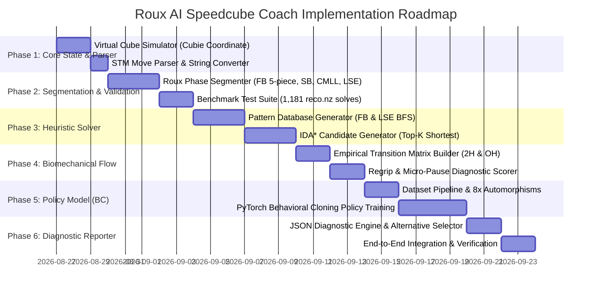

# Roux AI Speedcube Coach & Critique Engine: Master Specification & Implementation Plan

**Document Version:** 1.2.0  
**Target Platform:** Python 3.10+ (Core Library / Package)  
**Primary Method:** Roux Method for 3x3x3 (Two-Handed & One-Handed)  
**Author / Team:** Antigravity Pair-Programming Architecture  

---

## 1. Executive Summary & Core Philosophy

The **Roux AI Speedcube Coach & Critique Engine** is an intelligent, automated diagnostics and coaching system designed specifically for the **Roux method**. 

Unlike layer-by-layer methods (e.g. CFOP), Roux is fundamentally built around **intuitive 3D blockbuilding (F2B)** followed by **algorithmic and intuitive corners/edges steps (L10P)**. Traditional computer solvers often fail at coaching Roux because they suggest mathematically short but un-ergonomic solutions (e.g. $B\ D'\ F$) that human speedcubers would never execute. Furthermore, a slightly longer block solution (e.g. 8 moves vs 6 moves) is often vastly superior in practice if it uses home-grip fingertricks and sets up seamless continuation for the next step.

This system evaluates solves through a **3-Tier Evaluation Hierarchy**:
1. **Tier 1 — Deterministic Search (Math / Shortest Paths):** Generates candidate optimal solutions using Pattern Databases (PDB) and $IDA^*$ search.
2. **Tier 2 — Empirical Transition Matrix (Physical Biomechanics):** Evaluates physical execution flow, regrips, and turns-per-second (TPS) speed based on empirical transition data from real human smart cube solves.
3. **Tier 3 — Neural Policy Model (State-Aware Lookahead & Style):** Evaluates strategic human intuition, block preservation, pair choice, continuation into the next phase, and lookahead quality across 3D cube states.

```
┌─────────────────────────────────────────────────────────────────────────────┐
│                          SOLVE INPUT DATA                                   │
│  1. Timestamped Stream (Smart Cube Bluetooth JSON)                          │
│  2. Static Scramble + Solution String (Reconstruction / Forum Post)         │
└──────────────────────────────────────┬──────────────────────────────────────┘
                                       │
                                       ▼
┌─────────────────────────────────────────────────────────────────────────────┐
│                   MODULE 1: VIRTUAL CUBE STATE TRACKER                      │
│  - 3D Cubie Coordinate Representation (CP, CO, EP, EO, Centers)             │
│  - STM (Slice Turn Metric) Parser & State History Generator                 │
└──────────────────────────────────────┬──────────────────────────────────────┘
                                       │
                                       ▼
┌─────────────────────────────────────────────────────────────────────────────┐
│                   MODULE 2: ROUX PHASE SEGMENTER                            │
│  - First Block (FB: 5 moving pieces) + Concurrent Progress (e.g., SB Square)│
│  - Second Block (SB) [DR placement, Pair 1, Pair 2, Rotation Penalties]     │
│  - CMLL [42 Cases Classification, AUF Tracking, Recognition vs Execution]   │
│  - LSE [4a EO/EOLR/EOLR-b, 4b UL/UR Insertion, 4c M-Slice Permutation]      │
└──────────────────────────────────────┬──────────────────────────────────────┘
                                       │
                                       ▼
┌─────────────────────────────────────────────────────────────────────────────┐
│                   MODULE 3: 3-TIER EVALUATION ENGINE                        │
│                                                                             │
│  ┌───────────────────────────┐      ┌────────────────────────────────────┐  │
│  │ Tier 1: Deterministic     │      │ Tier 2: Empirical Transition       │  │
│  │ Candidate Search          │ ───► │ Matrix (Physical Flow & Regrips)   │  │
│  │ (PDB + IDA* Solver)       │      │ [2H & OH Bigram Latency Tables]    │  │
│  └─────────────┬─────────────┘      └─────────────────┬──────────────────┘  │
│                │                                      │                     │
│                └───────────────────┬──────────────────┘                     │
│                                    ▼                                        │
│                     ┌──────────────────────────────┐                        │
│                     │ Tier 3: Neural Policy Model  │                        │
│                     │ (Behavioral Cloning P(a|s)   │                        │
│                     │  Lookahead & Human Style)    │                        │
│                     └──────────────┬───────────────┘                        │
└────────────────────────────────────┼────────────────────────────────────────┘
                                     │
                                     ▼
┌─────────────────────────────────────────────────────────────────────────────┐
│                   MODULE 4: DIAGNOSTIC & COACHING LAYER                     │
│  - Structured Diagnostic Report (JSON Payload)                              │
│  - Detailed Step-by-Step Critique: [Issue] -> [Why Sub-optimal] -> [Better] │
│  - Solver Profile Adaptability (Right vs Left M-slice hand, Dominant hand)  │
└─────────────────────────────────────────────────────────────────────────────┘
```

---

## 2. Roux Method Domain Rules & Specification

### 2.1 Color Neutrality, Orientation, & Handedness
* **Color Neutrality Standard:** **Dual-Neutral ($x2y$)**.
  * White or Yellow on Bottom ($D$).
  * First Block (FB) built on Left Face ($L$).
  * Across $x2y$ automorphisms, Blue or Green (or Orange/Red depending on initial $y$-rotation) on Left.
* **Move Metric:** **Slice Turn Metric (STM)**.
  * Single slice turns ($M, M', M2$) and wide turns ($r, r', r2, l, l', l2$) count as **1 move**.
  * Rotations ($x, y, z$) count as **0 moves** in movecount, but carry **heavy execution penalties**.
* **Solver Ergonomic Profile:**
  * `m_slice_hand`: `"right"` (default) vs. `"left"`.
  * *Impact:* Solvers who flick $M'$ with the right ring finger have different optimal trigger flow ($M' U M'$ vs $M' U' M'$) than solvers using the left hand. The evaluation engine conditions its LSE advice on the user's hand profile.

---

### 2.2 Micro-Phase Segmentation Rules

#### Phase 1: First Block (FB)
* **Goal:** Solve a $1\times2\times3$ block on the Left face consisting of **5 moving cubies** (plus the fixed $L$ center):
  * **2 Corners:** $DFL, DBL$
  * **3 Edges:** $DL, FL, BL$
* **Completion Condition:** The exact move index where all 5 Left-block pieces are simultaneously in their solved positions and orientations relative to the $L$ center.
* **Concurrent Progress Detection:** When FB completes, the engine inspects the rest of the cube to reward advanced multi-tracking (e.g., if $DR$ is already solved, or if an $SB$ square/pair was formed during FB).
* **Efficiency vs. Ergonomics Principle:** While optimal FB average is $\approx 5.5$ moves, solutions up to $8-9$ moves are rated highly if they utilize rotationless home-grip moves ($\langle r, U, M \rangle$) and preserve $DR$/SB lookahead.

#### Phase 2: Second Block (SB)
* **Goal:** Solve a $1\times2\times3$ block on the Right face ($DR, FR, BR$ edges + $DFR, DBR$ corners + $R$ center) without disturbing FB.
* **Tracked Sub-Elements:**
  1. **DR Edge Placement:** Solved first (standard style) vs. attached to a pair vs. solved via non-standard square building.
  2. **Pair 1 vs. Pair 2 Order:** Back pair ($BR/DBR$) vs. Front pair ($FR/DFR$).
  3. **Rotation Penalty:** Strict flagging of any cube rotations ($y, x, z$). Rotationless discipline using $\langle R, r, M, U \rangle$ is required.
* **Continuation Scoring:** An SB pair sequence that leaves the second pair in the top layer (open lookahead) is rated higher than a sequence that traps pieces in the bottom layer.

#### Phase 3: Corners of the Last Layer (CMLL)
* **Goal:** Orient and permute all 4 $U$-layer corners without disturbing FB or SB.
* **Tracked Sub-Elements:**
  1. **Case Classification:** Exact identification of one of the **42 CMLL cases** (grouped by OLL shape: *Sune, Antisune, H, Pi, T, U, L, Skip*).
  2. **AUF Tracking:** Pre-AUF before the algorithm and Post-AUF after the algorithm.
  3. **Timing Breakdown:** Recognition pause latency ($\Delta t_{\text{pause}}$) vs. Execution TPS ($\text{TPS}_{\text{exec}}$).
  4. **Algorithm Verification:** Compare user's executed algorithm against standard optimal 2H/OH algorithms.

#### Phase 4: Last Six Edges (LSE / Step 4)
* **Sub-Step 4a (Edge Orientation & EOLR):**
  * **Standard EO:** All 6 remaining edges ($U$ and $M$ slices) oriented correctly.
  * **EOLR (Elite EO + LR tracking):** EO completed while simultaneously positioning $UL$ and $UR$ edges into $DF$ and $DB$ (bottom slots).
  * **EOLR-b (Direct Insertion):** EO completed with $UL$ and $UR$ directly inserted into their top solved positions ($UL$ and $UR$), skipping 4b.
* **Sub-Step 4b (UL/UR Edge Placement):**
  * $UL$ and $UR$ edges slotted into their respective left/right top positions.
  * Efficiency Benchmark: $\le 3$ moves STM when EOLR was utilized.
* **Sub-Step 4c (M-Slice & Center Permutation):**
  * Permuting the final 4 $M$-slice edges ($UF, UB, DF, DB$) and $U/D$ centers.
  * Case Identification: *Dots, Bars, Column, Opp-Opp, Solved*.

---

## 3. The 3-Tier Evaluation Engine

```
                                  [Cube State at Step t]
                                            │
                                            ▼
                  ┌──────────────────────────────────────────────────┐
                  │ 1. Deterministic Search (IDA* + PDBs)            │
                  │    Finds Top-K Shortest Paths (e.g. 5-move paths)│
                  └─────────────────────────┬────────────────────────┘
                                            │
                                            ▼
                  ┌──────────────────────────────────────────────────┐
                  │ 2. Empirical Transition Matrix                   │
                  │    Scores Physical Biomechanics & Fingertrick    │
                  │    Execution Latency for Each Candidate Path     │
                  └─────────────────────────┬────────────────────────┘
                                            │
                                            ▼
                  ┌──────────────────────────────────────────────────┐
                  │ 3. Neural Policy Model P(action | state)         │
                  │    Evaluates 3D Lookahead, Block Preservation,   │
                  │    and Human Speedcubing Intuition               │
                  └─────────────────────────┬────────────────────────┘
                                            │
                                            ▼
                  [Ranked Human-Optimal Alternatives & Diagnostics]
```

### 3.1 Tier 1: Deterministic Pattern Databases (PDB) & IDA* Search
* **State Representation:** 4 NumPy arrays:
  * `cp`: Corner Permutation (8 elements, values $0..7$)
  * `co`: Corner Orientation (8 elements, values $0..2$)
  * `ep`: Edge Permutation (12 elements, values $0..11$)
  * `eo`: Edge Orientation (12 elements, values $0..1$)

#### Detailed FB State Space & PDB Generation Math:
The First Block consists of 3 edges ($DL, FL, BL$) and 2 corners ($DFL, DBL$):
1. **Edge Combinations:** 
   $$\text{Edge States} = P(12, 3) \times 2^3 = (12 \times 11 \times 10) \times 8 = 1,320 \times 8 = 10,560$$
2. **Corner Combinations:**
   $$\text{Corner States} = P(8, 2) \times 3^2 = (8 \times 7) \times 9 = 56 \times 9 = 504$$
3. **Total First Block States (Canonical Orientation):**
   $$\text{Total FB States} = 10,560 \times 504 = \mathbf{5,322,240 \text{ states}}$$

#### Canonical Symmetry Re-Mapping (Covering all 8 First Blocks):
The 5.32M state table is calculated for **one canonical Left Block** (White bottom, Blue left).
To evaluate any of the **8 dual-neutral First Blocks** (e.g. Yellow bottom, Green left):
1. Transform the cube state via the symmetry automorphism $g \in G = \{I, y, y2, y', x2, x2y, x2y2, x2y'\}$.
2. Query the **single canonical 5.32M PDB** (`fb_pdb.npy`, **2.66 MB**).
3. Transform the candidate move sequences back into the solve orientation.
*Result:* A single 2.66 MB file evaluates all 8 First Blocks with **zero extra memory overhead**.

* **LSE Complete State Table:**
  * LSE subgroup ($\langle M, U \rangle$ generator): **7,680 reachable states** ($< 2 \text{ MB}$).

---

### 3.2 Tier 2: Empirical Bigram Transition Matrix (Smart Cube Telemetry)

Rather than guessing arbitrary ergonomic weights, move costs are derived empirically from real timestamped smart-cube solve streams.

#### Transition Latency Modeling
For every consecutive move pair $(m_{\text{prev}} \rightarrow m_{\text{curr}})$:
1. Filter out cognitive pauses ($\Delta t > 600\text{ms}$).
2. Compute median physical execution latency: $\overline{\Delta t}(m_{\text{prev}} \rightarrow m_{\text{curr}})$.
3. Normalize against baseline fastest home-grip transition ($\Delta t_{\min} \approx 95\text{ms}$):
$$\text{Cost}(m_{\text{prev}} \rightarrow m_{\text{curr}}) = \frac{\overline{\Delta t}(m_{\text{prev}} \rightarrow m_{\text{curr}})}{\Delta t_{\min}}$$

#### Dual Biomechanical Profiles
* **Matrix 2H:** Calibrated for two-handed solving ($\langle R, U, r, M \rangle$ home-grip flow; $M2$ ring-middle double flick).
* **Matrix OH:** Calibrated for one-handed solving (table-bouncing triggers, index/pinky $U$-flicks, $r U R' U'$ flow).

---

### 3.3 Tier 3: Neural Policy Model (Behavioral Cloning on Reconstructions)

The policy model $P(a_t \mid s_t)$ evaluates state-dependent human style and lookahead that pure move math and transition matrices cannot see.

* **Model Architecture:** Lightweight Transformer / Multi-Layer Perceptron (MLP) or GCN.
* **Inputs:** Flat one-hot state vector (stickers/cubies) + 1-bit conditioning vector `is_oh`.
* **Outputs:** Softmax probability distribution over 18 legal STM moves: $P(a_t \in \mathcal{A} \mid s_t)$.
* **Two-Stage Training Pipeline:**
  1. **Pre-training on Synthetic Data:** Train on 100,000 synthetic solves generated by the $IDA^*$ engine to learn legal cube physics and basic blockbuilding.
  2. **Fine-Tuning on Human Solves:** Fine-tune on augmented high-quality human reconstructions (reco.nz archive of Fahmi, Sean, Kian, Lau, Archer) to learn speedcubing style, pair choices, and lookahead habits.
* **Data Augmentation:** 8-fold $x2y$ Automorphism Multiplier:
  $$\text{Symmetry Group } G = \{I, y, y2, y', x2, x2y, x2y2, x2y'\}$$
  Expanding $\approx 18,000$ raw transitions into **$\approx 144,000$ pristine training transitions**.

---

## 4. Dual Dataset Strategy

To ensure robust machine learning and physical modeling, the project utilizes two complementary data sources:

| Dataset | Primary Source | Contents | Role in Engine |
| :--- | :--- | :--- | :--- |
| **Strategic Dataset** | **reco.nz Archive** (1,181 solves) | Scramble + Full Solution String + Step Split Times | Training the **Policy Model (Tier 3)**, validating the **Phase Segmenter**, evaluating pair choices, CMLL algs, and EOLR tracking. |
| **Telemetry Dataset** | **Smart Cube Telemetry** (cstimer / cubing.js logs) | Per-turn millisecond timestamps ($\Delta t$) | Calibrating the **Empirical Transition Matrix (Tier 2)**, measuring physical fingertrick latencies, and detecting regrips. |

---

## 5. Master Implementation Roadmap (Phased Milestones)



### Detailed Milestone Breakdown

#### Milestone 1: Virtual Cube Simulator & Move Parser
* **Target:** Standalone, high-performance Python 3D cubie state tracker and parser.
* **Key Tasks:**
  1. Implement `CubeState` with arrays `cp` (8), `co` (8), `ep` (12), `eo` (12), `centers` (6).
  2. Implement all 18 standard turns ($R, L, U, D, F, B$ and modifiers), 6 slice turns ($M, E, S$), 6 wide turns ($r, l, u, d, f, b$), and 3 cube rotations ($x, y, z$).
  3. Build `MoveParser` supporting both timestamped streams `[{"move": "R", "t_ms": 120}, ...]` and space-delimited notation strings `"r' U R' F R2"`.
  4. Write comprehensive unit tests (`test_cube_state.py`) verifying state consistency, algorithm inverses, and scramble tracking.

#### Milestone 2: Deterministic Roux Phase Segmenter & Benchmark Test Suite
* **Target:** Automatically segment any solve into exact Roux micro-phases with 100% reliability.
* **Key Tasks:**
  1. **FB Detector:** Detect Left 1x2x3 block (5 pieces) + detect simultaneous SB pieces / squares.
  2. **SB Detector:** Detect Right 1x2x3 block + track $DR$ edge timing and pair sequences + flag rotations.
  3. **CMLL Classifier:** Classify all 42 CMLL cases + isolate pre-AUF and post-AUF.
  4. **LSE Classifier:** Detect EO completion, classify EOLR vs. EOLR-b vs. standard EO, classify 4b, classify 4c.
  5. **Validation Test Suite:** Run segmenter across the 1,181 reco.nz solves dataset to verify 100% segmentation accuracy.

#### Milestone 3: Pattern Databases (PDB) & IDA* Heuristic Solver
* **Target:** Generate mathematical optimal solutions and top-$K$ candidates for FB, SB pairs, and LSE.
* **Key Tasks:**
  1. Precompute canonical FB PDB (5.32M states BFS) into a fast packed NumPy lookup table (`fb_pdb.npy`, ~2.66 MB).
  2. Implement canonical symmetry re-mapping to instantly query all 8 dual-neutral First Blocks.
  3. Precompute LSE state lookup table (7,680 states, $<2\text{ MB}$).
  4. Build $IDA^*$ search engine returning the top-$K$ shortest candidate paths.

#### Milestone 4: Empirical Transition Matrix Builder & Biomechanical Flow Scorer
* **Target:** Derive data-driven move cost tables from human smart cube datasets.
* **Key Tasks:**
  1. Build Bigram Transition Matrix builder for 2H and OH (`matrix_2h.json`, `matrix_oh.json`).
  2. Implement micro-pause and regrip detector based on inter-move latencies.
  3. Support user handedness configuration (`m_slice_hand: "right" | "left"`).
  4. Generate heatmap visualization to verify empirical transition times against human fingertricks.

#### Milestone 5: Neural Policy Model (Behavioral Cloning)
* **Target:** Train lightweight neural network to score human style, lookahead, and piece preservation.
* **Key Tasks:**
  1. Data pipeline applying 8x $x2y$ automorphisms to human reconstructions.
  2. Pre-train PyTorch model on synthetic IDA* solves (learning cube physics & blocks).
  3. Fine-tune model on elite human solve transitions (learning lookahead & style).
  4. Export model to ONNX for fast, lightweight local CPU inference.

#### Milestone 6: Diagnostic Engine & Structured Coaching Generator
* **Target:** Tie all modules together into a unified `analyze_solve()` Python API.
* **Key Tasks:**
  1. Aggregate phase metrics, detected mistakes, and ranked alternatives.
  2. Output clean, structured JSON diagnostic payload (`diagnostic_report.json`).
  3. Provide structured prompt templates for downstream LLM coaching generation.

---

## 6. Directory & Codebase Layout

```
roux_analyzer/
├── README.md
├── ROUX_AI_COACH_SPEC_AND_PLAN.md      <-- (This master specification document)
├── pyproject.toml / requirements.txt
├── data/
│   ├── roux_solves.json                <-- 1,181 reco.nz archive
│   ├── pdbs/
│   │   ├── fb_pdb.npy                  <-- 5.32M states FB database (~2.66MB)
│   │   └── lse_table.json              <-- 7,680 states LSE graph
│   └── transitions/
│       ├── matrix_2h.json              <-- 2H Bigram transition latencies
│       └── matrix_oh.json              <-- OH Bigram transition latencies
├── src/
│   └── roux_engine/
│       ├── __init__.py
│       ├── core/
│       │   ├── cube.py                 <-- 3D Cubie coordinate representation
│       │   ├── moves.py                <-- STM move operations & transforms
│       │   └── parser.py               <-- Move string & timestamped parser
│       ├── segmenter/
│       │   ├── segmenter.py            <-- Master Roux phase segmenter
│       │   ├── fb_detector.py          <-- FB (5 pieces) & concurrent progress
│       │   ├── sb_detector.py          <-- SB, DR & rotation tracker
│       │   ├── cmll_classifier.py      <-- 42 CMLL cases & AUF tracker
│       │   └── lse_classifier.py       <-- 4a (EOLR), 4b, 4c classifier
│       ├── solver/
│       │   ├── pdb_generator.py        <-- BFS PDB generator
│       │   ├── ida_star.py             <-- Top-K shortest path search
│       │   └── lse_solver.py           <-- Instant LSE lookup solver
│       ├── ergonomics/
│       │   ├── transition_matrix.py    <-- Bigram latency scorer
│       │   └── regrip_detector.py      <-- Regrip & pause classifier
│       ├── policy/
│       │   ├── model.py                <-- PyTorch / ONNX policy network
│       │   ├── dataset.py              <-- 8x Automorphism augmentations
│       │   └── ranker.py               <-- Candidate human-style ranker
│       └── diagnostics/
│           ├── engine.py               <-- Master solve analyzer pipeline
│           └── reporter.py             <-- JSON report generator
└── tests/
    ├── test_cube_state.py
    ├── test_segmenter.py
    ├── test_cmll_cases.py
    ├── test_solver.py
    └── test_reco_benchmark.py          <-- Solves benchmark verification
```

---

## 7. Verification & Benchmarking Standards

1. **Phase Segmentation Accuracy:** Must achieve **100% accuracy** on segmenting valid human reconstructions without crashing or misidentifying step transitions.
2. **CMLL Classification Accuracy:** Must correctly classify **100% of all 42 CMLL cases** and isolate pre/post AUF correctly.
3. **PDB Lookup Latency:** FB heuristic lookup must execute in **$< 1 \mu\text{s}$** per state query.
4. **End-to-End Solve Analysis Latency:** Full analysis of a 50-move solve (segmentation + diagnostics + alternative search) must complete in **$< 250\text{ms}$** on a standard CPU.
